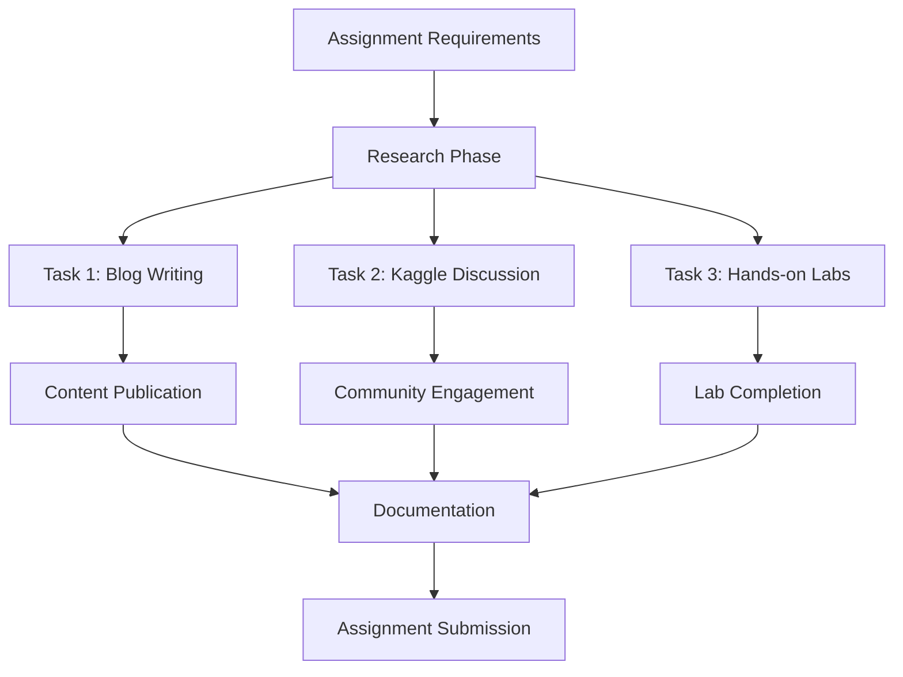

# 🌩️ Data Analytics in Cloud Computing - Assignment II

[](https://cloud.google.com/)
[](https://databricks.com/)
[](https://github.com/)

## 📋 Overview

This repository contains the comprehensive completion of **Assignment II** for the Data Analytics in Cloud Computing course. The assignment focuses on exploring cloud data concepts, understanding big data formats, and gaining hands-on experience with major cloud service platforms.

## 🎯 Assignment Objectives

- **Explore Cloud Data Architecture**: Understanding how data is stored, processed, and managed in cloud environments
- **Big Data Format Analysis**: Comparative study of different data formats for cloud-based analytics
- **Practical Cloud Experience**: Hands-on implementation using industry-standard cloud platforms
- **Technical Communication**: Creating educational content for the developer community

## 📊 Tasks Overview

### 🔹 Task 1: Technical Blog Post - "Data Floating in the Cloud"

**Objective**: Create an educational blog post explaining cloud data concepts for analytics

**📝 Deliverable**: Published technical article on dev.to platform

- **📰 Title**: [DATA FLOATING IN THE CLOUD](https://dev.to/abijith_rajab_7dc1ac8d79/data-floating-in-the-cloud-2m30)
- **🌐 Platform**: dev.to
- **📅 Status**: ✅ Published
- **🔗 Live Link**: https://dev.to/abijith_rajab_7dc1ac8d79/data-floating-in-the-cloud-2m30

**Key Topics Covered**:
- Cloud data storage architecture
- Data representation in cloud platforms
- Analytics-focused data management
- Cloud data accessibility and scalability

#### 📸 **Screenshots & Evidence**

<div align="center">

**Blog Post Publication on dev.to**

*Professional blog post published on dev.to platform*

**Article Content Preview**

*Detailed technical content about cloud data concepts*

</div>

---

### 🔹 Task 2: Kaggle Community Discussion - Parquet vs CSV Analysis

**Objective**: Initiate a technical discussion comparing file formats for big data analytics

**💬 Deliverable**: Community discussion post on Kaggle

- **📰 Title**: [Why Parquet is Better than CSV for Big Data in the Cloud](https://www.kaggle.com/discussions/general/615203)
- **🌐 Platform**: Kaggle Discussions
- **📅 Status**: ✅ Published
- **🔗 Discussion Link**: https://www.kaggle.com/discussions/general/615203

**Analysis Focus**:
- **Performance Comparison**: Query speed and processing efficiency
- **Storage Optimization**: Compression ratios and storage costs
- **Columnar vs Row-based**: Architecture benefits for analytics
- **Cloud Integration**: Native support in major cloud platforms
- **Use Case Scenarios**: When to choose each format

#### 📸 **Screenshots & Evidence**

<div align="center">

**Kaggle Discussion Post**

*Technical discussion initiated on Kaggle platform*

**Community Engagement**

*Community responses and technical insights shared*

**Performance Analysis Charts**

*Detailed comparison charts showing Parquet vs CSV performance*

</div>

---

### 🔹 Task 3: Google Cloud Skills - Hands-on Laboratory Experience

**Objective**: Complete practical labs to gain real-world cloud experience

**🧪 Platform**: Google Cloud Skills Boost

**📈 Achievement**: **100% Assessment Score** across all labs

#### ✅ Completed Labs:

| Lab Name | Platform | Status | Focus Area |
|----------|----------|---------|------------|
| **Derive Insights from BigQuery Data: Challenge Lab** | Google Cloud | ✅ Completed | Data Analytics & SQL |
| **Datastore: Qwik Start** | Google Cloud | ✅ Completed | NoSQL Database |
| **Dataplex: Qwik Start - Console** | Google Cloud | ✅ Completed | Data Lake Management |
| **Dataproc: Qwik Start - Command Line** | Google Cloud | ✅ Completed | Big Data Processing |

#### 🛠️ Skills Acquired:
- **BigQuery**: Advanced SQL analytics on large datasets
- **Cloud Datastore**: NoSQL document database operations
- **Dataplex**: Unified data lake management and governance
- **Dataproc**: Managed Apache Hadoop and Spark clusters

#### 📸 **Lab Completion Screenshots**

<div align="center">

**Google Cloud Skills Dashboard**

*100% completion status across all required labs*

**BigQuery Challenge Lab**

*Derive Insights from BigQuery Data: Challenge Lab completion*

**Datastore Qwik Start**

*Successfully completed Datastore: Qwik Start lab*

**Dataplex Console Lab**

*Dataplex: Qwik Start - Console lab completion*

**Dataproc Command Line Lab**

*Dataproc: Qwik Start - Command Line lab completion*

**Lab Certificates/Badges**

*Achievement badges and certificates earned*

</div>

## 🏗️ Technical Architecture

```
Cloud Data Analytics Pipeline
├── Data Ingestion
│   ├── Batch Processing (Dataproc)
│   └── Real-time Streaming
├── Data Storage
│   ├── Structured (BigQuery)
│   ├── NoSQL (Datastore)
│   └── Data Lake (Dataplex)
├── Data Processing
│   ├── ETL Operations
│   └── Analytics Queries
└── Data Insights
    ├── Reporting
    └── Visualization
```

## 📚 Learning Outcomes

### 🎓 Knowledge Gained:
- **Cloud Data Architecture**: Understanding of scalable data systems
- **File Format Optimization**: Performance implications of different formats
- **Google Cloud Platform**: Hands-on experience with GCP services
- **Big Data Processing**: Practical skills in data pipeline management
- **Technical Communication**: Ability to explain complex concepts clearly

### 🔧 Technical Skills Developed:
- BigQuery SQL optimization
- Cloud data pipeline design
- NoSQL database management
- Data lake governance
- Performance analysis and comparison

## 🔄 Project Workflow



## 📈 Impact & Results

- **📝 Educational Content**: Created valuable resources for the developer community
- **💬 Community Engagement**: Initiated meaningful technical discussions
- **🏆 Practical Skills**: Achieved 100% completion rate in all hands-on labs
- **🔍 Technical Analysis**: Provided data-driven insights on file format selection

## 🔗 External Links & Resources

- **Blog Post**: [Data Floating in the Cloud](https://dev.to/abijith_rajab_7dc1ac8d79/data-floating-in-the-cloud-2m30)
- **Kaggle Discussion**: [Parquet vs CSV Analysis](https://www.kaggle.com/discussions/general/615203)
- **Google Cloud Skills**: [Google Cloud Skills Boost Platform](https://www.cloudskillsboost.google/)

## 👨‍💻 Author

**Abijith Raja B**
- 🌐 Platform: [dev.to Profile](https://dev.to/abijith_rajab_7dc1ac8d79)
- 📊 Kaggle: [Kaggle Profile](https://www.kaggle.com/)

## 📄 License

This project is part of an academic assignment and is intended for educational purposes.

---

**📅 Assignment Completion Date**: November 2025  
**🏫 Course**: Data Analytics in Cloud Computing  
**📋 Assignment**: Assignment II  
**✅ Status**: Completed with 100% Assessment Score